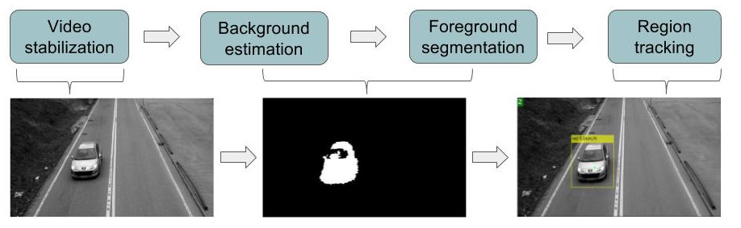
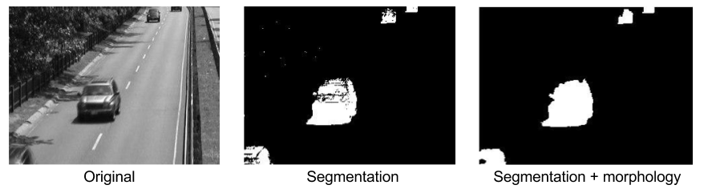
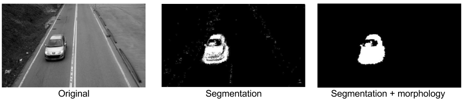

## Overview
In this project we propose a video surveillance system which is able to count the amount of vehicles passing by the road and predict its speed. Computer vision systems are cheaper than RADAR based traffic monitoring systems; they require a simpler and cheaper hardware. The main tradeoff is that the algorithm are more complex, thus, the development cycle is longer and the workload is higher. Nowadays, we can find affordable cameras with reliable hardware, therefore, the computer vision algorithms are capable of running in real time eventhough the amount of workload.

## Technology
In order to achive our goals we need to use different techniques such as video stabilization, foreground segmentation, mathematical morphology and object tracking.

### Video Compensation
Video compensation plays an important role. Usually the cameras are placed in poles or signs and due to wind or other factors they suffer from vibrations. Having a jittery sequence makes the algorithms less robust; so it is important to process the video to generate a smooth sequence.

To compensate the video we use Optical Flow obtained with the block matching algorithm. The following sequence shows the difference of using video compensation and not using it. In  the two right images we can see the sequence and the sequence of the original video; and in the two left image we have the same sequences using video compensation. We can observe that the segmentation results are better.

### Background Estimation and Foreground Segmentation
This first step aims to segment the moving objects in the image; this is done by creating a statistical model of the background. We have used a single gaussian adaptative approach in order to model the background. The method has two parameters: alpha, which controls the tolerance of the system, and rho, which provides memory to the model for variable background scenarios. 

We filtered the segmented image using morphological operators. By doing so we are able to remove the noise of the image as well as small artifacts. The experiments that we carried out to determine the best paramets of the segmenatation and morphology are shown in the *Project Slides* in the Resources section.

In the following figures we have a comparison doing segmentation with and without morphology. The results show two diferent frames from two of the sequences that we worked with. 

### Object tracking and speed estimation

We perform the object tracking on the segmented frames. We use a connected components analysis on the segmented frames to detect blobs and we track them using Kalman Filters. Then, once we have identified the different blobs that appear in the image and they are being tracked across consecutive frames, the speed estimation process is performed. To estimate the speed of a vehicle we compute the displacement in pixels of the detection with respect to the previous position. The displacement is computed by projecting the current and previous positions to a plane where the pixel distance is equivalent in the whole image. Then, the velocity can be estimated by knowing the FPS (Frames Per Second) of the video and the distance in meters equivalent to the distance in pixels.
In order to perform speed estimation in any road, the only requirements are that we must first measure the road to monitorize to calibrate the speed estimator and we must know the FPS of the camera. Additionally, we can track a car whith known velocity to further calibrate the speed estimator.
To count the vehicles we keep an historic of all the blobs tracked along with their speed.

## Results

## Resources
* [Project Slides](https://docs.google.com/presentation/d/1YJnj8e_IcnCdWf5vRDw2Jt1kaXgdwhmclmG2308rm10/edit#slide=id.g20d2e7dda2_0_134).

* [Project Code](https://github.com/mcv-m4-video/mcv-m4-2017-team6)

* [Project Paper(under construction)]()

* [Dataset](http://www.changedetection.net/)

## Authors
* Guillem Cucurull [Github](https://github.com/gcucurull)

* Arnau Baró [Github](https://github.com/arbamas)

* Pau Cebrian [Github](https://github.com/paucebr)

* Victor Campmany [Github](https://github.com/vcampmany)
